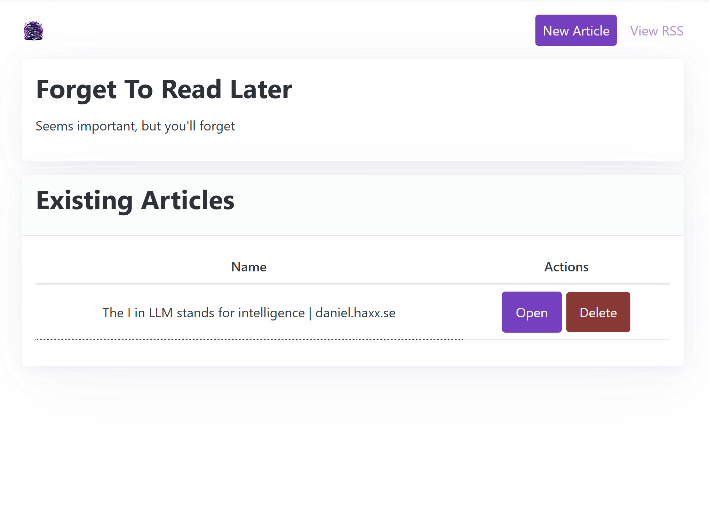
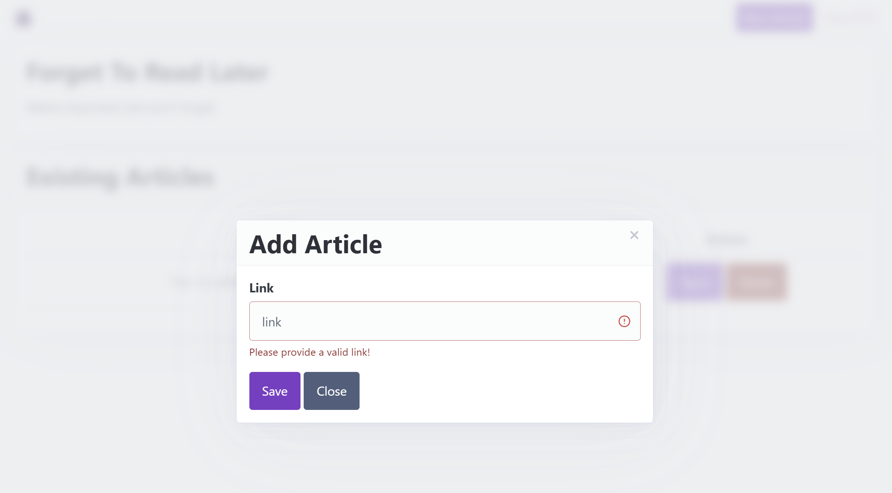
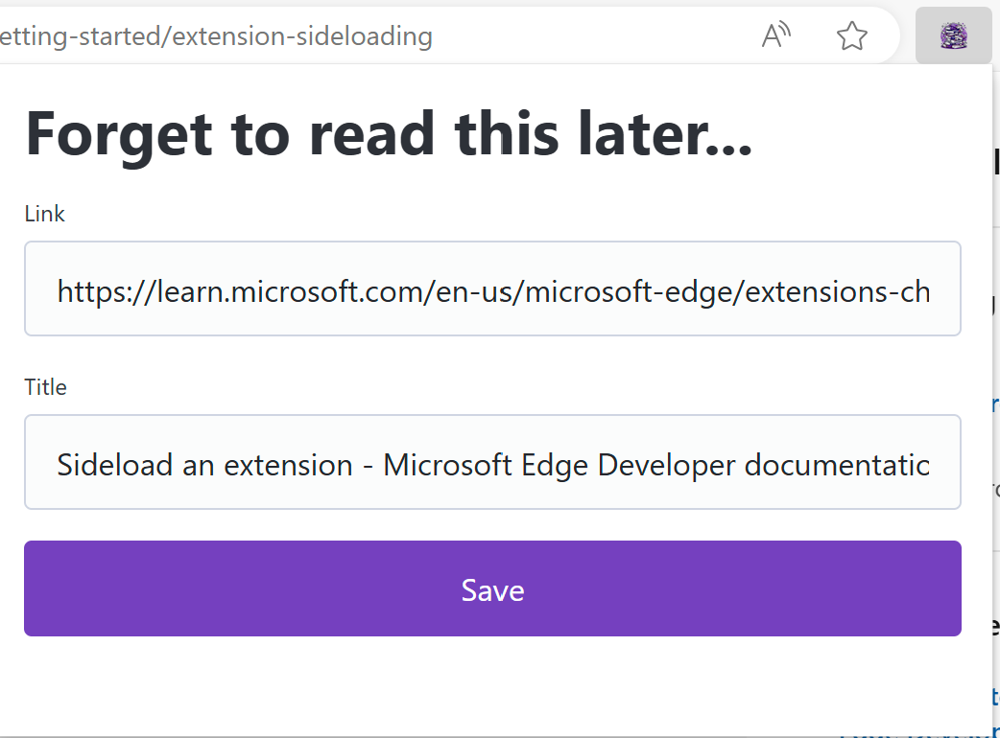
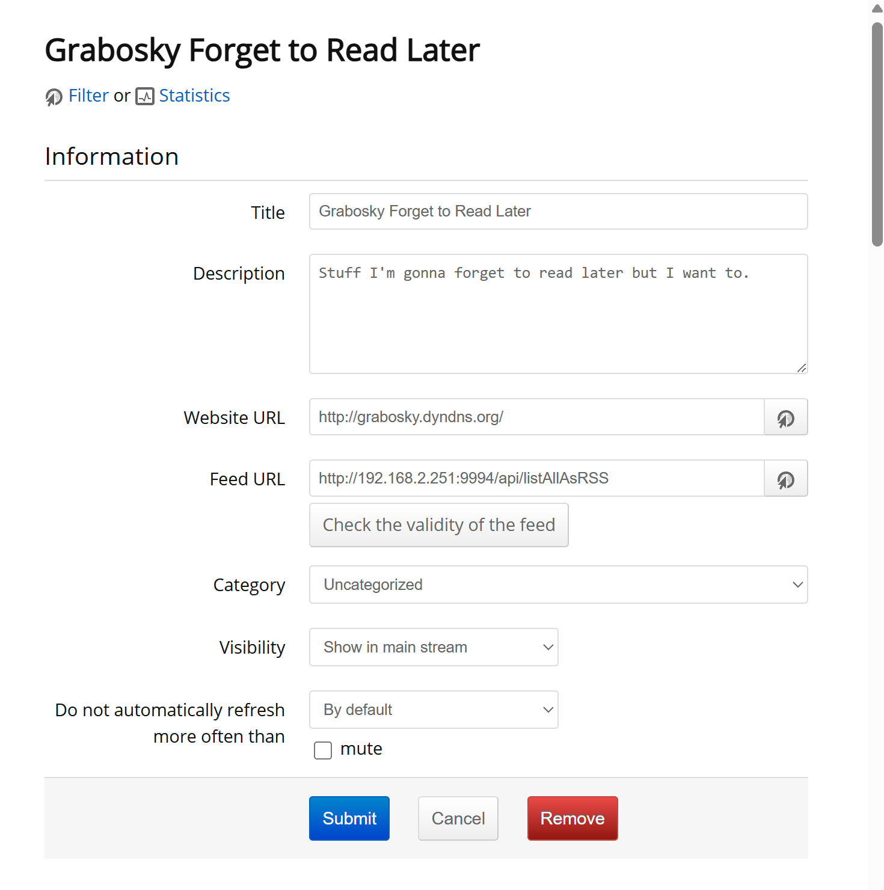

# Forget to Read Later

## What is this

A simple web interface of links to remember to read later. It generates an RSS XML feed and JSON feed.Those are meant to be pumped into a tool like FreshRSS. I use this in conjunction with FluentReader.

Links are automatically pulled to get the title and description (first paragraph).

* Web interface: `http://server/`
* JSON URL: `http://server/api/listAll`
* RSS URL: `http://server/api/listAllAsRSS`

## Running
Create a `.env` file in `backend` with a single linke of `MDBCONNSTR="mongodb+srv://"` with your MongoDB Server

## App Screenshots

## Browser Extension
Tested on Edge using [these instructions](https://learn.microsoft.com/en-us/microsoft-edge/extensions-chromium/getting-started/extension-sideloading) to load an unpacked extension. Need to change [this line](https://github.com/graboskyc/ForgetToReadLater/blob/main/Extension/popup/popup.js#L15) to your server.

## Use within FreshRSS

## Techstack
* Database - MongoDB
* Language - python
* Server - FastAPI
* Design - PicoCSS
* Interactivity - AlpineJS
* RSS Generation - rfeed
* Web Scraping - requests + BeautifulSoup